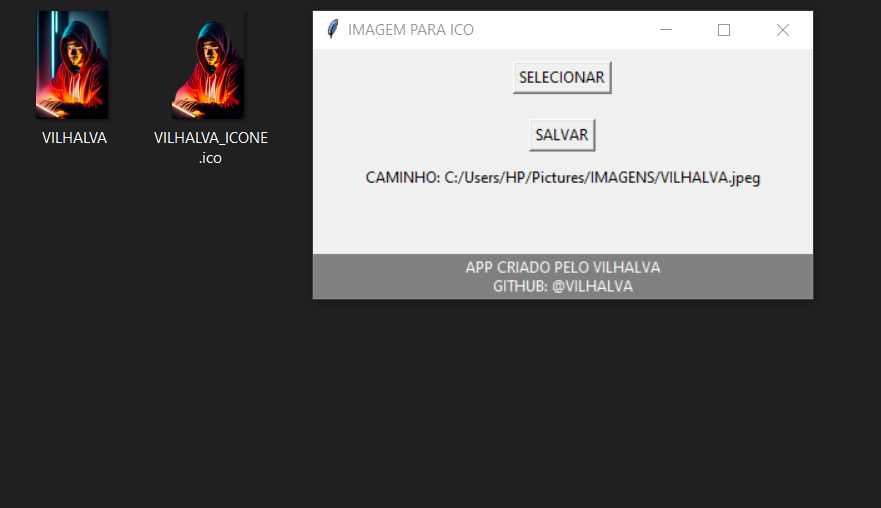

# IMAGEM PARA ICO
🎈USE ESSE APP PARA REMOVER O FUNDO DAS SUAS FOTOS E CONVERTER PARA ICO (ICONE).

 <br>

## DESCRIÇÃO:
Este aplicativo é uma interface gráfica simples que permite aos usuários selecionar uma imagem de qualquer formato e remover o fundo da imagem usando a biblioteca `rembg`. Após remover o fundo, a imagem é convertida para o formato de ícone (.ico) usando a biblioteca `PIL` (Python Imaging Library). Finalmente, o aplicativo salva a imagem resultante, agora com o fundo removido e no formato de ícone, no mesmo diretório em que a imagem original foi selecionada.

## FUNCIONALIDADES:
1. **Selecionar Imagem**: Os usuários podem clicar no botão "SELECIONAR" para escolher uma imagem de qualquer formato em seus sistemas de arquivos locais.
  
2. **Remover Fundo e Salvar como Ícone**: Depois de selecionar a imagem, o usuário pode clicar no botão "SALVAR" para iniciar o processo de remoção do fundo e conversão para o formato de ícone (.ico). Uma vez concluído o processo, a imagem resultante é salva no mesmo diretório da imagem original.

3. **Feedback de Sucesso**: Após a conclusão bem-sucedida do processo de remoção de fundo e conversão para ícone, uma caixa de diálogo é exibida informando ao usuário que o fundo foi removido e a imagem foi salva com sucesso.

## POR QUE CRIEI ESTE APLICATIVO?
- Desenvolvi este aplicativo porque me vi frequentemente frustrado por precisar abrir o `GIMP` apenas para converter imagens em ícones depois de remover o fundo delas. Esta solução simplificou significativamente a vida de quem necessita criar ícones para seus aplicativos.

- Na verdade, este projeto é uma extensão do [REMOVEDOR DE FUNDO DE IMAGEM](https://github.com/VILHALVA/REMOVEDOR-DE-FUNDO-DE-IMAGEM). A principal distinção é que este aplicativo converte automaticamente a imagem em um ícone após remover o fundo.

## COMO USAR?
### BAIXANDO O PROJETO:
**Passo 1:** Clone o repositório para o seu sistema local.

```bash
git clone https://github.com/VILHALVA/IMAGEM-PARA-ICO.git
```

**Passo 2:** Navegue até o diretório do projeto.

```bash
cd IMAGEM-PARA-ICO
```

**Passo 3:** Descompacte o arquivo ZIP (se você baixou manualmente):

```bash
unzip IMAGEM-PARA-ICO.zip
```

### EXECUTANDO O EXECUTAVEL:
1. **Localize o Arquivo:** Após o download, localize o arquivo executável no seu sistema. Geralmente, os downloads são salvos na pasta "Downloads" do seu computador, mas você pode tê-lo salvo em outro local.

2. **Duplo Clique:** Para executar o arquivo, basta dar um duplo clique sobre ele. Isso abrirá o programa associado ao arquivo. Se o arquivo for um instalador, ele iniciará o processo de instalação. Se for um programa independente, ele será iniciado.

3. **Permissões de Administrador:** Dependendo do programa e das configurações do seu computador, você pode precisar de permissões de administrador para executá-lo. Se solicitado, clique com o botão direito do mouse no arquivo executável e selecione "Executar como administrador".

4. **Compatibilidade:** Certifique-se de que o executável seja compatível com a versão do seu sistema operacional. Se você estiver usando um sistema operacional Windows x64, o executável deve ser compilado para x64 para funcionar corretamente. Isso é importante porque o sistema operacional x64 não pode executar aplicativos compilados apenas para x86 (32 bits).

5. **Dependências:** Verifique se o executável depende de algum software adicional ou bibliotecas para funcionar corretamente. Às vezes, você pode precisar instalar outras ferramentas ou componentes antes de executar o executável.

6. **Configurações de Segurança:** Se o seu sistema operacional estiver configurado para bloquear a execução de aplicativos de fontes desconhecidas ou não confiáveis, você pode precisar ajustar as configurações de segurança para permitir a execução do executável.

7. **Atualizações e Patches:** Por fim, verifique se há atualizações ou patches para o executável, especialmente se for um software de terceiros. As atualizações podem corrigir problemas conhecidos ou adicionar novos recursos ao programa.

### EXECUTANDO O SCRIPT PYTHON:
- Para executar o código Python `(CODIGO.py)` em um PC zerado, ou seja, em um computador onde o Python não está instalado, você precisará seguir alguns passos adicionais para configurar o ambiente de execução. Aqui está um guia básico para isso:

1. **Baixe e Instale o Python:**
   - A primeira etapa é baixar o instalador do Python para o seu sistema operacional. Você pode encontrar o instalador oficial em [python.org](https://www.python.org/downloads/).
   - Se você estiver usando o Windows, certifique-se de baixar a versão adequada para o seu sistema operacional (32 bits ou 64 bits).
   - Siga as instruções do instalador para instalar o Python no seu PC.

2. **Configuração das Variáveis de Ambiente (opcional):**
   - No Windows, é uma boa prática adicionar o diretório de instalação do Python ao PATH do sistema. Isso permite que você execute comandos Python de qualquer diretório no prompt de comando.
   - Para fazer isso, após a instalação, procure "Variáveis de Ambiente" nas configurações do sistema, e adicione o caminho para o diretório de instalação do Python (normalmente algo como C:\PythonXX, onde XX é a versão do Python).

3. **Transferindo o Script para o PC:**
   - Transfira o arquivo `nome-do-arquivo.py` para o PC. Isso pode ser feito por meio de um pen drive, rede local, ou qualquer outro método de transferência de arquivo.

4. **Executando o Script:**
   - Abra um prompt de comando (no Windows, pressione `Win + R`, digite "cmd" e pressione Enter).
   - Navegue até o diretório onde o `nome-do-arquivo.py` está localizado usando o comando `cd` (por exemplo, `cd C:\Caminho\Para\O\nome-do-arquivo.py`).
   - Execute o script digitando `python nome-do-arquivo.py` e pressionando Enter.

5. **Instalando Dependências:**
   ```bash
   pip install rembg
   ```

Seguindo esses passos, você poderá executar o seu script Python em um PC zerado, mesmo sem ter o Python instalado anteriormente. Certifique-se de que todas as dependências do script estejam instaladas e que o Python esteja configurado corretamente no seu sistema. Se você não estiver familiarizado com esses passos, confira nosso [curso completo sobre o Python](https://github.com/VILHALVA/CURSO-DE-PYTHON) para obter orientações detalhadas.

## SAIBA MAIS:
- [PROJETO CRIADO PELO VILHALVA](https://github.com/VILHALVA)
- [VERSÃO MELHORADA DO "REMOVEDOR DE FUNDO DE IMAGEM"](https://github.com/VILHALVA/REMOVEDOR-DE-FUNDO-DE-IMAGEM)
- [FAÇA OS NOSSOS CURSOS](https://github.com/VILHALVA?tab=repositories&q=+topic:CURSO)


